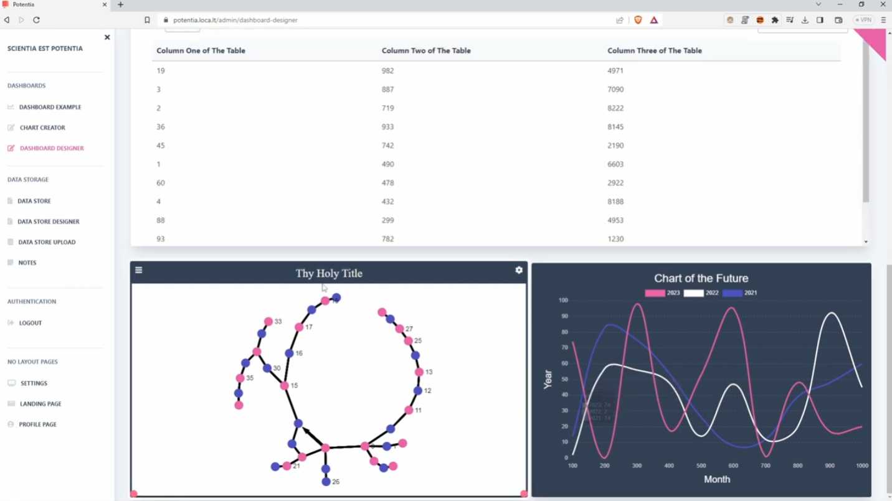
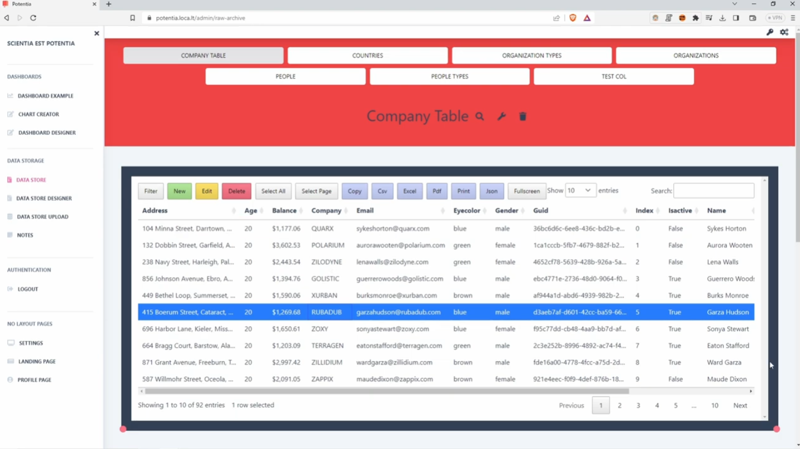
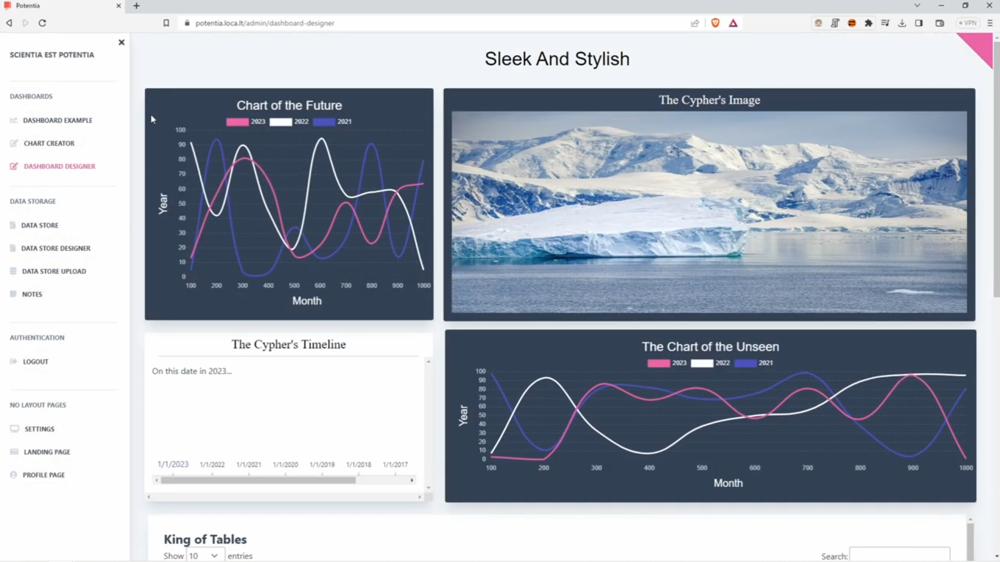

# Dashboard Software

## Overview

This Dashboard Software is a passion project developed over multiple years. It's a versatile CRUD application designed to store data and generate sophisticated dashboards. The software includes a range of functionalities from note-taking and data management to comprehensive dashboard creation with support for various data visualizations.

### Key Features

- **Data Management**: Upload and manage raw JSON files. The software parses these files and stores the data in a MongoDB database, serving as the data source for dashboards.
- **Dynamic Dashboards**: Create, customize, and save dashboards. Users can generate charts, and position and resize these components to suit their preferences.
- **User Authentication**: Features a fully functional login and registration system to manage user access.
- **Settings Control**: Customize website aesthetics, manage roles, and control registration settings through a dedicated admin page.
- **Video Demonstration**: Check out our [YouTube video](https://www.youtube.com/watch?v=3yhtXmI0QGo) showcasing the software in action.

## Software Structure

- **`tests/`**: Contains Selenium tests, including login functionality.
- **`seeders/`**: MongoDB database seeders to easily populate your database with initial data.
- **`flask_app/`**: The core Flask application written in Python.
  - **`flask_app/client/`**: Front-end client built with Svelte.js and jQuery.
- **`nginx/`**: Configuration files for setting up an Nginx reverse proxy.
- **Docker**: Includes Dockerfiles for containerization and a `docker-compose.yml` at the root to orchestrate services.

## Gallery

Here are some screenshots of the software:

## Getting Started

To get started with this project, clone the repository and follow the setup instructions detailed in the subsequent sections. Ensure you have Docker and MongoDB installed on your system to utilize the full functionalities of this software.

